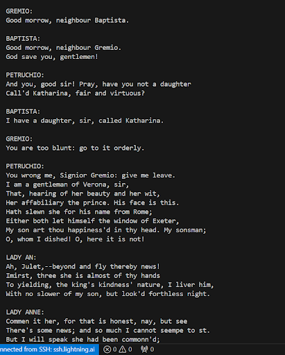

# GPT-2 from Scratch: Decoder-Only Transformer

This repository contains a complete, from-scratch implementation of a **GPT-style Decoder-only Transformer**. The project covers the entire pipeline from raw data ingestion and sub-word tokenization to a functional training loop — trained to generate **Shakespearean-style dialogue**.

---

## 🚀 Technical Approach

The model is designed as a generative language model that leverages self-attention to understand and predict text sequences.

### 1. Data & Tokenization
* **Custom BPE Tokenizer:** Implemented a **Byte Pair Encoding (BPE)** algorithm from scratch. This sub-word level tokenizer allows the model to handle a large vocabulary efficiently while managing rare words better than character-level models.
* **Embeddings:** Combines **Contextual Embeddings** (learned during training) with **Positional Embeddings** to ensure the model understands the relative order of tokens.
* **Pre-Normalization:** Uses **Layer Normalization** at the start of each transformer block (Pre-Norm) to ensure training stability and faster convergence.

### 2. Decoder-Only Architecture

The model follows the *GPT (Generative Pre-trained Transformer)* architecture — a decoder-only transformer, with several deliberate deviations from the vanilla GPT-2 specification.

```
Input Token IDs (B, T)
        ↓
GetEmbedding
    ├── Token Embedding  (vocab_size → n_embed)
    └── Position Embedding  (block_size → n_embed)
        ↓
Transformer Block × n_blocks
    ├── Custom LayerNorm  (ε = 1e-6, Pre-Norm)
    ├── Multi-Head Self-Attention
    │       ├── Fused QKV Projection  → Linear(n_embed, 3 × n_embed, bias=False)
    │       ├── Split into heads  → (B, num_heads, T, head_size)
    │       ├── Scaled Dot-Product  (scale = head_size⁻⁰·⁵)
    │       ├── Causal Mask  (torch.tril → masked_fill with -inf)
    │       ├── Softmax + Attention Dropout
    │       └── Output Projection  → Linear(n_embed, n_embed)
    ├── Residual Connection  (x = x + attn(ln1(x)))
    ├── Custom LayerNorm  (ε = 1e-6, Pre-Norm)
    ├── FeedForward MLP
    │       ├── Expansion  → Linear(n_embed, 4 × n_embed)
    │       ├── ReLU Activation  ⚠️ (GPT-2 uses GELU)
    │       ├── Dropout
    │       └── Projection  → Linear(4 × n_embed, n_embed)
    └── Residual Connection  (x = x + mlp(ln2(x)))
        ↓
Final Custom LayerNorm
        ↓
Linear Projection → Vocabulary Logits  (n_embed → vocab_size)
        ↓
Cross-Entropy Loss (training)  /  Top-K Sampling with Temperature (generation)
```

#### Key Components

| Component | Description |
| :--- | :--- |
| *Token Embedding* | Learned lookup table mapping token IDs → dense vectors |
| *Position Embedding* | Learned positional encodings — tells the model WHERE each token is |
| *Multi-Head Attention* | Multiple attention heads each learning different relationships |
| *Causal Mask* | Lower triangular mask — tokens can only attend to past tokens |
| *FeedForward* | Per-token MLP with 4x expansion — processes gathered context |
| *Residual Connections* | `x = x + sublayer(x)` — prevents vanishing gradients |
| *LayerNorm* | Normalizes activations — stabilizes training |
| *Top-K Sampling* | During generation, only sample from top-K most likely tokens |

#### Detailed Component Breakdown
* **Multi-Head Attention (MHA):** Implemented multiple attention heads to allow the model to focus on different parts of the sequence simultaneously, capturing various linguistic perspectives.
* **Residual Connections:** Every block uses skip-connections to ensure gradients flow easily through deep layers.
* **Feed-Forward Network (FFN):** Includes a linear bottleneck that expands the hidden dimension by **4x** to capture "factual" knowledge before projecting back to the embedding size.
* **Softmax Output:** The final layer produces a probability distribution across the entire BPE vocabulary to predict the next token.

---

## 📂 Codebase Structure

```
project-root/
    ├── Dataloader.py          # Handles remote data fetching and raw text stream management
    ├── BPETokeniser.py        # Scratch-built BPE logic for training and encoding/decoding
    ├── Preprocessing.py       # Manages get_batch logic, tensor conversion, train/val splitting
    ├── Block.py               # Transformer layers, Multi-Head Attention, and FFN modules
    ├── train.py               # Main entry point: training loop and generation logic
    └── outputs/
        ├── output1.png                  # Generation output — Part 1
        ├── output2(continued).png       # Generation output — Part 2
        ├── output3(continued).png       # Generation output — Part 3
        └── output4(continued).png       # Generation output — Part 4
```

| File | Description |
| :--- | :--- |
| **`Dataloader.py`** | Handles remote data fetching and raw text stream management. |
| **`BPETokeniser.py`** | The scratch-built BPE logic for training and encoding/decoding. |
| **`Preprocessing.py`** | Manages `get_batch` logic, tensor conversion, and train/val splitting. |
| **`Block.py`** | Contains the Transformer layers, Multi-Head Attention, and FFN modules. |
| **`train.py`** | The main entry point. Contains the training loop and generation logic. |

---

## 🏆 Achievement: Coherent Shakespearean Generation

A key milestone of this project is the model's ability to **generate thematically coherent, multi-character Shakespearean dialogue** from a short seed prompt — entirely from a GPT-2 architecture built from scratch.

### What the model learned to do
Given a seed excerpt from *The Taming of the Shrew*, the model independently generates:
- ✅ **Historically accurate character names** — Lady Anne, Gloucester, Northumberland, Henry Bolingbroke, King Richard II, Duke of York, Duke of Aumerle (real Shakespearean figures)
- ✅ **Thematic coherence** — Generation stays consistently within Shakespeare's English History Plays (*Henry IV*, *Richard II*, *Richard III*) — demonstrating the model has internalized *play-level* context
- ✅ **Dialogue structure** — Correctly formats speaker labels followed by speech, maintaining the theatrical format throughout
- ✅ **Period-appropriate language** — Generates Early Modern English syntax (thee, thy, doth, hath) consistently
- ✅ **Gradual, stable degradation** — Quality degrades gracefully over longer outputs rather than collapsing abruptly

### Sample Output Progression

> **Seed context provided:** *"You wrong me, Signior Gremio: give me leave."*

#### Part 1 — Early Generation


#### Part 2 — Continued
.png)

#### Part 3 — Continued
.png)

#### Part 4 — Extended Generation
.png)

> The model sustains character identity, thematic context, and linguistic register across all four output segments — a strong signal that the self-attention mechanism is capturing long-range dependencies in the Shakespearean corpus.

---

## 📊 Training Logs & Generation Sequence

Below is the sequential progression of the model's text generation as captured during the training process:

| Stage | Description |
| :--- | :--- |
| **Part 1** | Initial generation immediately post-seed |
| **Part 2** | Model sustains History Play characters (Bolingbroke, Gloucester) |
| **Part 3** | Cross-character dialogue with Richard II, Northumberland, Aumerle |
| **Part 4** | Extended coherent generation — longest stable output window |

---

## 📌 Notes

- All components (BPE tokenizer, transformer blocks, training loop) are implemented **from scratch** — no HuggingFace, no pre-built transformer libraries.
- Training corpus: Complete works of Shakespeare (plain text).
- Generation uses **Top-K sampling** for diversity while avoiding degenerate repetition.
